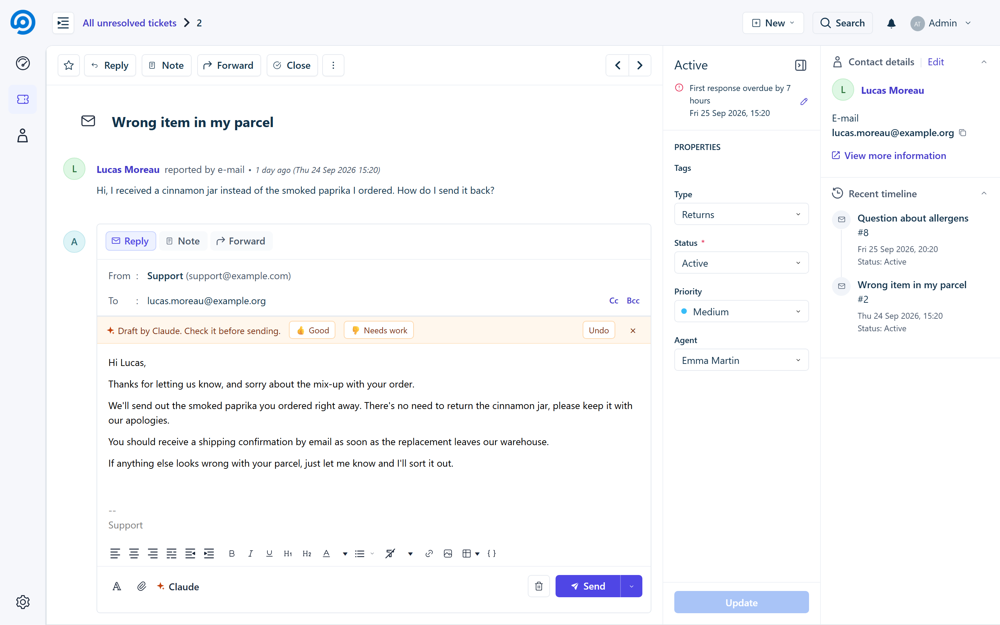
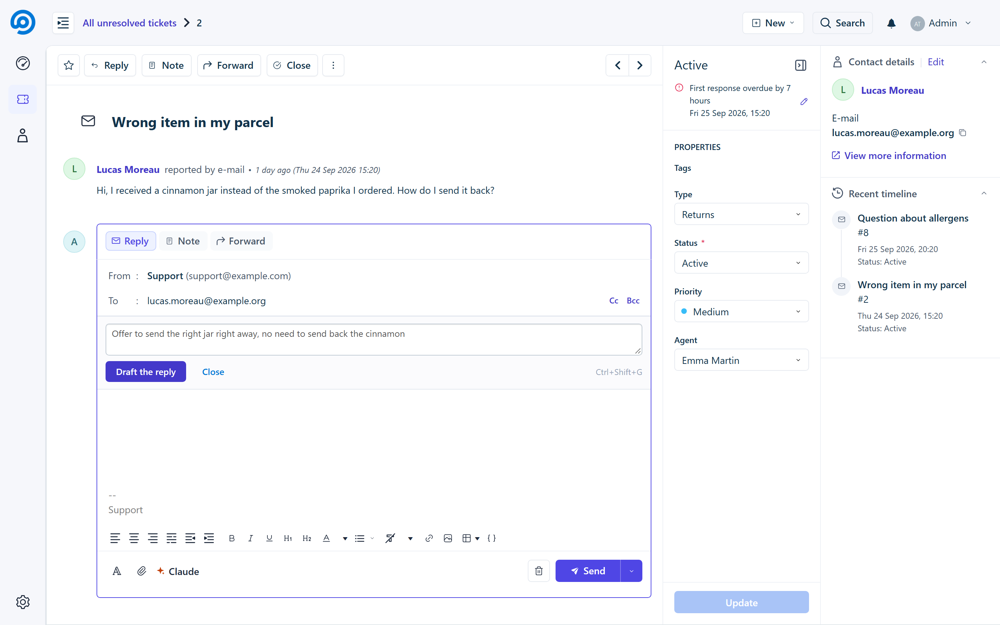
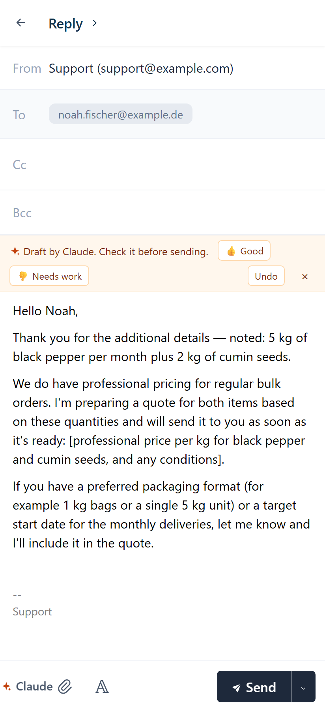
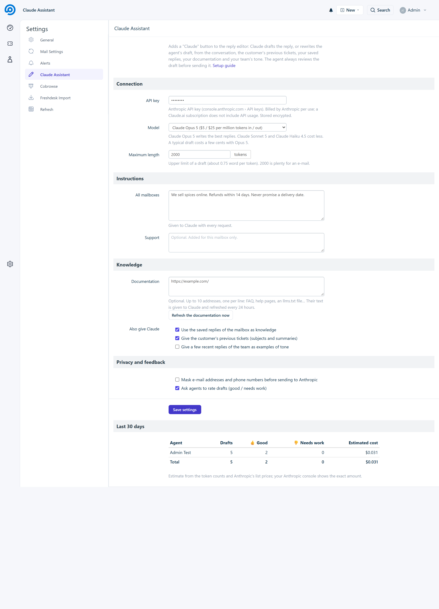

# Claude Assistant for FreeScout

**Draft and improve replies with Claude, from FreeScout's reply editor.** A "Claude" button writes the reply to the
conversation, or rewrites the draft the agent started, using what a good agent would look at: the conversation, the
customer's previous tickets, your saved replies, your documentation and the way your team usually writes. The draft
goes into the editor: nothing is sent without the agent.

It is a regular FreeScout module: one API key on the server, nothing to install in the agents' browsers, and it works
wherever FreeScout's editor does (standard interface, [Refresh](https://github.com/altmenorg/freescout-refresh),
phone).



## Features

- **Draft the reply** with one click, or **Ctrl+Shift+G**. Add an optional instruction for this reply: "refuse
  politely", "offer a voucher", "ask for a photo of the parcel"…
- **Rewrite my draft**: write a few words or a rough answer, Claude turns it into a ready-to-send reply.
- **Knowledge**, all optional:
  - instructions for all mailboxes and per mailbox (who you are, your policies, the tone, what never to promise);
  - your **saved replies** (Saved Replies module), reused as facts and wording;
  - **documentation pages** (FAQ, help pages, `llms.txt`), fetched and cached for 24 hours;
  - the **customer's previous tickets**;
  - a few **recent replies of your team**, as examples of tone and length.
- **No invented facts**: Claude is told to use only what it was given and to leave placeholders like
  `[tracking number]` for the agent to fill.
- Replies in the **customer's language**.
- **Feedback**: agents rate each draft (good / needs work). The settings page shows, for the last 30 days, drafts,
  ratings and the estimated cost per agent.
- **Privacy option**: mask e-mail addresses and phone numbers before anything is sent to Anthropic.
- **Prompt caching**: instructions and knowledge are cached by the API, so the next drafts of a mailbox cost less.
- English and French.



<p></p>

## Requirements

- FreeScout 1.8 or newer, PHP 7.1+ with cURL (no Composer dependency: the module calls the Claude API directly,
  since Anthropic's PHP SDK needs PHP 8.1).
- An **Anthropic API key** from [console.anthropic.com](https://console.anthropic.com), with credit. API usage is
  billed by Anthropic per use; a Claude.ai subscription does not include it.

## Installation

1. Download [`ClaudeAssistant.zip`](https://github.com/altmenorg/freescout-claude-assistant/releases/latest/download/ClaudeAssistant.zip) from the latest release and unzip it into the `Modules` folder of FreeScout: you get `Modules/ClaudeAssistant`
   (the folder **must** have this name).
2. **Manage › Modules**: activate **Claude Assistant** (this creates its statistics table).
3. **Manage › Settings › Claude Assistant**: paste the API key, write your instructions, save.

**Updates:** from version 1.0.1, FreeScout tells you in **Manage › Modules** when a new version is out, and the **Update** button installs it in one click. From an older version, update once by hand as above.

## Settings

| Setting | |
|---|---|
| **API key** | Stored encrypted; shown as asterisks. |
| **Model** | Claude Opus 5 (default, best writing), Claude Sonnet 5 or Claude Haiku 4.5 (cheaper). |
| **Maximum length** | Upper limit of a draft, in tokens (2000 by default). |
| **Instructions** | For all mailboxes, then optionally per mailbox. |
| **Documentation** | Up to 10 addresses, one per line, refreshed every 24 hours (or now, with the button). |
| **Options** | Saved replies, previous tickets, tone examples, masking of e-mails and phones, feedback. |



## Cost

A draft sends the conversation plus your instructions and knowledge, and receives a reply of a few hundred words.
With Claude Opus 5 ($5 / $25 per million input / output tokens) a typical draft costs a few cents; Claude Haiku 4.5
costs about five times less. Instructions and knowledge are cached by the API, which lowers the cost of the next
drafts. The settings page gives an estimate; your Anthropic console shows the exact amount.

## Privacy

When an agent asks for a draft, the conversation of that ticket (and, depending on the options, the customer's
previous ticket summaries, your saved replies, your documentation and a few recent replies of the team) is sent to
Anthropic's API. Anthropic does not train its models on API data by default; see
[Anthropic's commercial terms and privacy policy](https://www.anthropic.com/legal). Use the masking option to remove
e-mail addresses and phone numbers first, and mention this processing in your own privacy policy if needed.
The module stores no conversation content: only token counts and ratings, for the statistics.

## For module developers

Other modules can add context to the request (orders, subscription, account…):

```php
\Eventy::addFilter('claudeassistant.context', function ($sections, $conversation) {
    $sections[] = "Last order of this customer: #1234, shipped on 2026-09-20.";
    return $sections;
}, 20, 2);
```

## Other modules from the Refresh project

This module was built as part of [Refresh](https://github.com/altmenorg/freescout-refresh), a new interface for FreeScout. The modules of the project, all usable on their own:

- **[Refresh](https://github.com/altmenorg/freescout-refresh)**: a new, Freshdesk-inspired interface for FreeScout: views, SLA badges, dashboard, properties panel, phone version.
- **[Web Push](https://github.com/altmenorg/freescout-webpush)**: install FreeScout as an app on phones and desktops, with end-to-end encrypted Web Push notifications.
- **[Cobrowse](https://github.com/altmenorg/freescout-cobrowse)**: co-browse with your customers (Cobrowse.io) from the ticket sidebar, to guide them on your website or app.
- **[Freshdesk Import](https://github.com/altmenorg/freescout-freshdesk-import)**: import your Freshdesk tickets into FreeScout and keep them in sync until you switch over.

## Credits

Claude Assistant is not affiliated with or endorsed by Anthropic. "Claude" is a trademark of Anthropic PBC, used here
only to name the service the module connects to.

## License

[GNU AGPL v3](LICENSE), like FreeScout.
